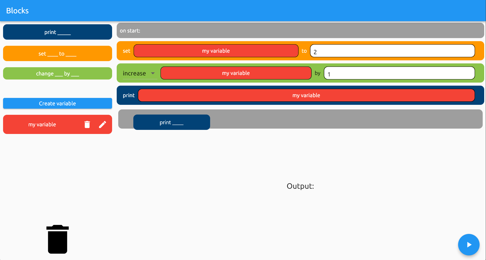

A sad attempt to remake Scratch in flutter. 
See sad new features below:

# Download:
1. Go into "Actions" tab

2. Select a run that passes (green check) and is on "main" branch

3. Click it and download artifact.zip

1. Run blocks.msix (no virus I swear)

